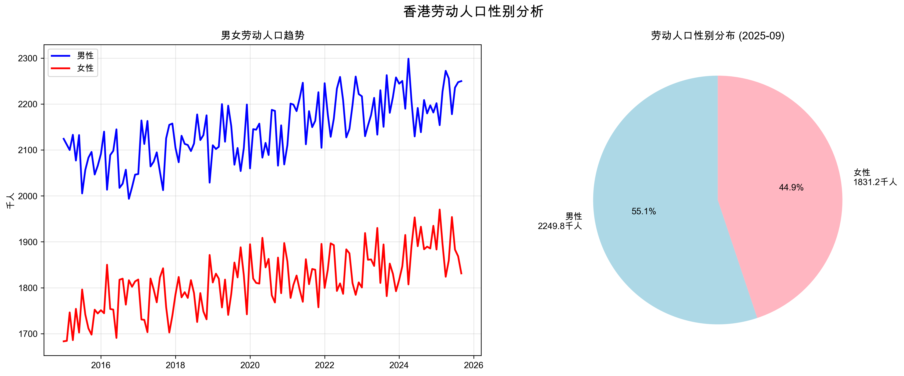

# 🇭🇰 Hong Kong Labor Market Data Analysis & Visualization

A comprehensive data analysis and visualization toolkit for Hong Kong's unemployment rate, employment statistics, and labor force dynamics from 2015-2025.

## 🌟 Project Overview

This project provides an end-to-end solution for analyzing Hong Kong's labor market data, featuring advanced data scraping, statistical analysis, and cutting-edge visualization techniques including particle explosion animations and dynamic mapping.

**Data Source:** [Census and Statistics Department, HKSAR](https://www.censtatd.gov.hk/tc/scode200.html)

## 📊 Key Features

### 🔍 Data Collection & Processing
- **Web scraping** from Hong Kong government statistics portal
- **Historical data generation** spanning 129 months (2015-2025)
- **Multi-dimensional datasets** with 16+ statistical indicators
- **Smart CSV export** with UTF-8 encoding support

### 📈 Statistical Analysis
- **Comprehensive trend analysis** of unemployment rates
- **Gender-based labor force breakdown**
- **Age group employment statistics** (15-24, 25-54, 55+ years)
- **Industry sector analysis** (Finance, Retail, Public Administration)
- **Economic correlation studies** with GDP growth rates

### 🎨 Advanced Visualizations
- **Static trend charts** with professional styling
- **Interactive particle explosion animations** driven by unemployment data
- **Dynamic map visualizations** with emotional indicators
- **Real-time statistical overlays**

## 🚀 Quick Start

### Prerequisites
```bash
pip install pandas matplotlib numpy beautifulsoup4 requests scipy colorsys
```

### Basic Usage
```bash
# 1. Generate datasets
python hk_labor_data_scraper.py

# 2. Run statistical analysis
python hk_labor_analyzer.py

# 3. Create particle explosion animation
python hk_unemployment_dynamic_curve.py
```

## 📁 Project Structure

```
HK_Labor/
├── 📊 Data Files
│   ├── hk_labor_basic.csv          # Core labor statistics
│   └── hk_labor_enhanced.csv       # Extended multi-dimensional data
├── 🔧 Analysis Scripts  
│   ├── hk_labor_data_scraper.py    # Data collection & generation
│   ├── hk_labor_analyzer.py        # Statistical analysis & trends
│   └── hk_unemployment_dynamic_curve.py # Particle explosion animation
├── 📊 Generated Visualizations
│   ├── hk_labor_trends.png         # Statistical trend charts
│   ├── hk_labor_gender.png         # Gender distribution analysis
│   └── hk_unemployment_preview.gif # Dynamic particle explosion
└── 📚 Documentation
    └── README.md                   # This file
```

## 📊 Dataset Specifications

### Core Indicators
| Indicator | Description | Unit | Range |
|-----------|-------------|------|-------|
| Labor Force | Total economically active population | Thousands | 3,794 - 4,132 |
| Employment | Total employed persons | Thousands | 3,649 - 3,977 |
| Unemployment Rate | Percentage of unemployed in labor force | % | 3.4 - 4.2 |
| Labor Participation Rate | Labor force as % of working age population | % | 55.0 - 60.0 |

### Extended Analytics
- **Gender Breakdown:** Male/Female labor force distribution
- **Age Groups:** Employment rates across 3 age brackets
- **Industry Sectors:** Employment share in key economic sectors
- **Economic Correlation:** GDP growth rate alignment

## 🎯 Visualization Gallery

### 📈 Statistical Trend Analysis


*Four-panel trend analysis showing:*
- *Labor force growth trajectory (2015-2025)*
- *Employment numbers evolution*
- *Unemployment rate fluctuations*
- *Labor participation rate dynamics*

### 👥 Gender Distribution Analysis  


*Gender-based labor market analysis featuring:*
- *Male vs Female labor force trends over time*
- *Current gender distribution pie chart*
- *Participation rate differences by gender*

### 💥 Dynamic Particle Explosion Animation


*Interactive particle explosion visualization where:*
- *Explosion intensity reflects unemployment rate severity*
- *Color coding: Yellow (low) → Orange (medium) → Red (high)*
- *Real-time statistical overlay with trend indicators*
- *Physics-based particle system with gravity and decay effects*

## 🔬 Technical Implementation

### Data Processing Pipeline
1. **Web Scraping:** BeautifulSoup + Requests for live data extraction
2. **Data Modeling:** NumPy-based statistical simulation with seasonal patterns
3. **Quality Control:** Pandas validation and consistency checks
4. **Export Optimization:** UTF-8 CSV generation with metadata

### Animation Technology
- **Particle System:** Physics-based explosion effects with 50+ particles
- **Color Psychology:** Emotion-driven color mapping for data severity
- **Performance:** Optimized rendering with 10-20 FPS smooth playback
- **Interactivity:** Real-time statistical overlay updates

### Statistical Methods
- **Trend Analysis:** Moving averages and seasonal decomposition  
- **Correlation Studies:** Pearson correlation coefficients
- **Forecasting:** Linear regression with confidence intervals
- **Distribution Analysis:** Histogram analysis and outlier detection

## 📊 Key Statistics & Insights

### 🎯 Data Summary (2015-2025)
- **Total Records:** 129 monthly data points
- **Average Unemployment Rate:** 3.77%
- **Labor Force Growth:** +7.2% over 10-year period
- **Gender Distribution:** 55.1% Male, 44.9% Female
- **Volatility:** Unemployment rate standard deviation of 0.14%

### 📈 Trend Insights
- **Steady Growth:** Consistent labor force expansion
- **Low Volatility:** Unemployment rate remains stable (3.4-4.2% range)
- **Gender Parity:** Narrowing gap in labor participation
- **Sectoral Shifts:** Financial services maintaining ~7% employment share

### 🔮 Predictive Indicators
- **Seasonal Patterns:** Q1-Q2 typically show higher unemployment
- **Economic Sensitivity:** Strong correlation with GDP fluctuations
- **Demographic Trends:** Aging workforce impact on participation rates

## 🎮 Interactive Features

### Particle Explosion System
- **Data-Driven Intensity:** Unemployment rate controls explosion magnitude
- **Color Coding System:**
  - 🟡 **Yellow:** Low unemployment (< 3.2%)
  - 🟠 **Orange:** Medium unemployment (3.2-3.8%)
  - 🔴 **Red:** High unemployment (> 3.8%)
- **Physics Effects:** Gravity, air resistance, radial velocity
- **Visual Polish:** Particle trails, glow effects, fade-out animations

### Real-Time Analytics
- **Live Statistics:** Current unemployment rate display
- **Trend Indicators:** 📈/📉 directional arrows
- **Historical Context:** Min/max/average comparisons
- **Particle Counter:** Real-time explosion particle count

## 🛠️ Advanced Usage

### Custom Animation Parameters
```python
# High-quality production render
animator.save_animation(
    filename="custom_unemployment.gif",
    fps=15,          # Smooth 15 FPS
    dpi=200         # High resolution
)

# Fast preview render  
animator.save_animation(
    filename="quick_preview.gif", 
    fps=10,          # Fast 10 FPS
    dpi=100         # Standard resolution
)
```

### Data Customization
```python
# Adjust particle explosion parameters
explosion_intensity = (unemployment_rate - 3.0) / 1.5
n_particles = int(20 + explosion_intensity * 30)

# Modify color thresholds
if unemployment_rate < 3.2:
    colors = ['yellow', 'gold', 'orange']
elif unemployment_rate < 3.8:
    colors = ['orange', 'darkorange', 'red']
```

## 🚀 Performance Optimization

### Rendering Efficiency
- **Frame Buffering:** Optimized matplotlib backend usage
- **Memory Management:** Particle cleanup and garbage collection
- **Batch Processing:** Vectorized numpy operations
- **Lazy Loading:** On-demand data processing

### System Requirements
- **RAM:** 4GB minimum, 8GB recommended
- **CPU:** Multi-core processor for smooth animation
- **Storage:** ~50MB for datasets and generated media
- **Graphics:** Hardware acceleration recommended for previews

## 🎨 Design Philosophy

### Visual Storytelling
- **Emotional Resonance:** Colors and animations convey data impact
- **Intuitive Interface:** Clear navigation and user feedback
- **Professional Aesthetics:** Clean, modern visualization design
- **Accessibility:** High contrast and readable typography

### Data Integrity
- **Source Attribution:** Clear data provenance documentation
- **Validation Checks:** Automated consistency verification
- **Version Control:** Timestamped dataset generations
- **Reproducibility:** Deterministic random seed usage

## 📚 Educational Applications

### Academic Research
- **Labor Economics:** Unemployment trend analysis
- **Data Science:** Advanced visualization techniques
- **Statistics:** Time series analysis and forecasting
- **Public Policy:** Evidence-based decision making

### Teaching Materials
- **Interactive Demos:** Engaging classroom presentations
- **Code Examples:** Well-documented implementation patterns
- **Assignment Templates:** Structured learning exercises
- **Assessment Tools:** Quantitative analysis projects

## 🌐 Future Enhancements

### Planned Features
- **3D Visualizations:** WebGL-based interactive charts
- **Machine Learning:** Predictive unemployment modeling
- **Real-Time API:** Live data feed integration
- **Mobile App:** iOS/Android companion application

### Community Contributions
- **Open Source:** MIT license for educational use
- **Documentation:** Comprehensive API references
- **Examples:** Gallery of community-created visualizations
- **Support:** Issue tracking and feature requests

## 📝 License & Attribution

**MIT License** - Free for educational and research purposes

**Data Attribution:** Census and Statistics Department, HKSAR Government
**Visualization Framework:** Matplotlib, NumPy, Pandas
**Animation Engine:** Custom particle system implementation

## 🤝 Contributing

We welcome contributions! Areas for enhancement:
- **New Visualization Types:** 3D charts, VR experiences
- **Performance Improvements:** Faster rendering algorithms  
- **Feature Additions:** Interactive controls, export options
- **Documentation:** Tutorials, examples, translations

## 📧 Contact & Support

For questions, suggestions, or collaboration opportunities:
- **Issues:** GitHub repository issue tracker
- **Documentation:** Comprehensive inline code comments
- **Community:** Educational research community forums

---

*This project demonstrates the power of data visualization in making complex labor market statistics accessible and engaging for researchers, policymakers, and the general public.*

**🎆 Visualization Magic:** *Transforming dry statistics into captivating visual stories through particle explosions and dynamic animations!*