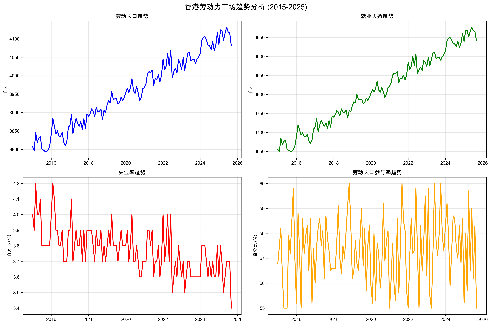
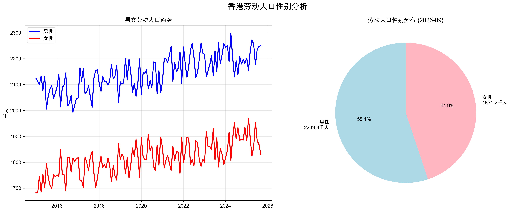

# Hong Kong Data Visualization Project

A comprehensive data analysis and visualization project focusing on two key aspects of Hong Kong: labor market statistics and typhoon weather patterns. This project combines advanced data scraping, statistical analysis, and dynamic visualization techniques to create engaging animations and insights.
## 🏗️ Project Structure

```
Assignment2_2025/
├── HK_Labor/                    # Hong Kong Labor Market Analysis
├── HK_Typhoon_animation/        # Hong Kong Typhoon Data Visualization
├── .venv/                       # Python virtual environment
├── .gitignore                   # Git ignore rules
└── README.md                    # This file
```

## 📊 HK_Labor - Labor Market Analysis

A complete toolkit for analyzing Hong Kong unemployment rates with innovative particle explosion animations driven by unemployment data.

### Key Features
- **Data Scraping**: Automated extraction from HK Census and Statistics Department
- **Statistical Analysis**: Comprehensive trend analysis and visualization
- **Particle Animation**: Unemployment rate-driven explosion effects
- **129 Months of Data**: Complete dataset from 2015-2025

### Files Overview
```
HK_Labor/
├── hk_labor_data_scraper.py      # Web scraper for HK government statistics
├── hk_labor_analyzer.py          # Statistical analysis and charts
├── hk_unemployment_dynamic_curve.py  # Particle explosion animation
├── hk_labor_enhanced.csv         # Complete dataset (129 months)
├── hk_labor_basic.csv            # Basic dataset
├── hk_labor_trends.png           # Trend analysis chart
├── hk_labor_gender.png           # Gender distribution chart
├── hk_unemployment_preview.gif   # Particle explosion animation preview
└── README.md                     # Detailed project documentation
```

### Animation Features
- 💥 **Particle Explosions**: Intensity scales with unemployment rates
- 🎨 **Dynamic Colors**: Color-coded by unemployment severity (Yellow→Orange→Red)
- ✨ **Physics Effects**: Gravity, air resistance, and glow effects
- 📊 **Real-time Statistics**: Live data display during animation
- 🎬 **High-Quality Output**: Multiple resolution GIF export options

## 🌪️ HK_Typhoon_animation - Weather Data Visualization

Interactive typhoon warning animations based on 68+ years of Hong Kong Observatory historical data.

### Key Features
- **Historical Data**: Complete HKO typhoon warnings from 1956-2024
- **Multiple Visualizations**: Static charts and dynamic animations
- **Two Animation Engines**: Matplotlib and PIL-based generators
- **Responsive Design**: Adjustable animation parameters
```
HK_Typhoon_animation/
├── typhoon_animation.py              # Main Matplotlib-based animator
├── create_cyclone_animation.py       # PIL-based animation generator
├── hko_tropical_warnings_1956_2024.csv  # 68+ years of typhoon data
├── cyclone_anim_py.gif               # Matplotlib animation output
├── cyclone_animation.gif             # PIL animation output
├── cyclone_visualization.png         # Static visualization
└── README.md                         # Detailed project documentation
```

### Animation Features
- 🌌 **Universe Background**: Starry night sky animation
- 📈 **Data-Driven**: Typhoon frequency drives visual intensity
- 🎯 **Multi-format Output**: Both GIF and PNG export
- 📊 **Historical Trends**: Visual representation of 68+ years of data

## 🚀 Quick Start

### Prerequisites
```bash
Python 3.8+
Virtual environment (recommended)
```

### Setup
```bash
# Clone the repository
git clone https://github.com/Monica-TPJH/Data_visualization_Assignment2.git
cd Data_visualization_Assignment2

# Create and activate virtual environment
python3 -m venv .venv
source .venv/bin/activate  # On Windows: .venv\Scripts\activate

# Install dependencies
pip install pandas matplotlib numpy beautifulsoup4 requests seaborn scipy pillow
```

### Running the Projects

#### HK Labor Analysis
```bash
cd HK_Labor
python hk_unemployment_dynamic_curve.py  # Interactive particle animation
python hk_labor_analyzer.py              # Generate static charts
python hk_labor_data_scraper.py          # Scrape latest data
```

#### HK Typhoon Animation
```bash
cd HK_Typhoon_animation
python typhoon_animation.py              # Matplotlib-based animation
python create_cyclone_animation.py       # PIL-based animation
```

## 📈 Sample Outputs

### Labor Market Visualization



### Labor Market Dynamic Animation
**Particle Explosion Animation - Unemployment Rate Driven Effects**


*The particle explosion intensity and color change dynamically based on unemployment rates - higher unemployment creates more intense red explosions, while lower rates produce gentler yellow effects.*

### Typhoon Visualization


### Typhoon Dynamic Animations
**Matplotlib-based Universe Animation**


**PIL-based Cyclone Animation**


*Both animations visualize 68+ years of typhoon warning data with different artistic approaches - the first features a starry universe background, while the second focuses on cyclone formation patterns.*

## 🛠️ Technical Stack

- **Languages**: Python 3.8+
- **Data Processing**: pandas, numpy
- **Visualization**: matplotlib, seaborn, PIL
- **Web Scraping**: beautifulsoup4, requests
- **Scientific Computing**: scipy
- **Animation**: matplotlib.animation, PIL

## 📊 Data Sources

### Labor Statistics
- **Source**: Hong Kong Census and Statistics Department
- **URL**: https://www.censtatd.gov.hk/tc/scode200.html
- **Coverage**: Monthly labor force statistics (2015-2025)
- **Update Frequency**: Monthly

### Typhoon Data
- **Source**: Hong Kong Observatory (HKO)
- **Coverage**: Tropical cyclone warning signals (1956-2024)
- **Data Points**: 68+ years of historical typhoon warnings
- **Categories**: Multiple warning signal levels

## 🎯 Key Innovations

### Advanced Animation Techniques
- **Particle Physics**: Custom particle systems with gravity and air resistance
- **Data-Driven Visualization**: Animation parameters controlled by real data
- **Multi-layered Effects**: Combining static backgrounds with dynamic elements
- **Performance Optimization**: Efficient rendering for large datasets

### Professional Documentation
- **Comprehensive README**: Detailed setup and usage instructions
- **Code Documentation**: Well-commented Python scripts
- **Visual Examples**: Embedded charts and animation previews
- **English Localization**: Complete translation from Chinese interface

## 🔧 Configuration Options

### Animation Parameters
```python
# Labor Animation
frames = 308                    # Animation length
fps = 15                       # Frame rate
particle_count = 20-50         # Particles per explosion
explosion_intensity = 0.1-1.0  # Based on unemployment rate

# Typhoon Animation  
background_stars = 200         # Star field density
animation_speed = 100ms        # Frame interval
color_scheme = "universe"      # Background theme
```

## 📝 Usage Examples

### Generate Labor Market Report
```python
from HK_Labor.hk_labor_analyzer import analyze_labor_data
report = analyze_labor_data('hk_labor_enhanced.csv')
report.generate_charts()
```

### Create Custom Animation
```python
from HK_Labor.hk_unemployment_dynamic_curve import HKUnemploymentCurveAnimator
animator = HKUnemploymentCurveAnimator()
animator.save_animation("custom_animation.gif", fps=20, dpi=150)
```

## 🤝 Contributing

1. Fork the repository
2. Create a feature branch (`git checkout -b feature/amazing-feature`)
3. Commit your changes (`git commit -m 'Add amazing feature'`)
4. Push to the branch (`git push origin feature/amazing-feature`)
5. Open a Pull Request

## 📄 License

This project is created for educational and research purposes. Data sources are credited to their respective organizations.

## 🙏 Acknowledgments

- **Hong Kong Census and Statistics Department** - Labor market data
- **Hong Kong Observatory** - Historical typhoon warning data
- **Python Community** - Excellent visualization libraries
- **Open Source Contributors** - matplotlib, pandas, and other dependencies

## 📞 Contact

For questions, suggestions, or collaboration opportunities:
- **Repository**: https://github.com/Monica-TPJH/Data_visualization_Assignment2
- **Issues**: https://github.com/Monica-TPJH/Data_visualization_Assignment2/issues

---

**Project Status**: ✅ Active Development  
**Last Updated**: September 25, 2025  
**Version**: 2.0.0